# Proof for #18

Head: `8f307d3` on `ticket/18-landing`.

- `red-account-sheet.txt`, `red-landing-view.txt`: the view tests fail before the components exist.
- `green-account-sheet.txt`: the sheet tests pass.
- `red-e2e-landing.txt`: `e2e/landing.spec.ts` fails against main's placeholder landing.
- `green-e2e-landing.txt`: the landing and smoke e2e pass.
- `gate.txt`: `bun run check` on the final tree.

## Screenshots
### landing, 390 px, light
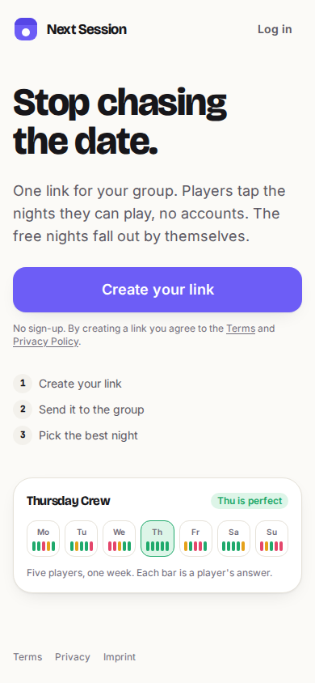
### landing, 390 px, dark
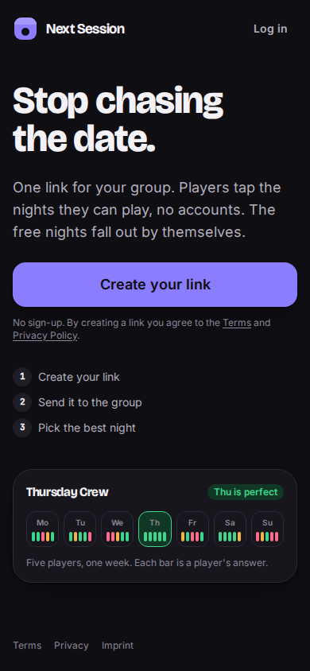
### landing, 1440 px, light
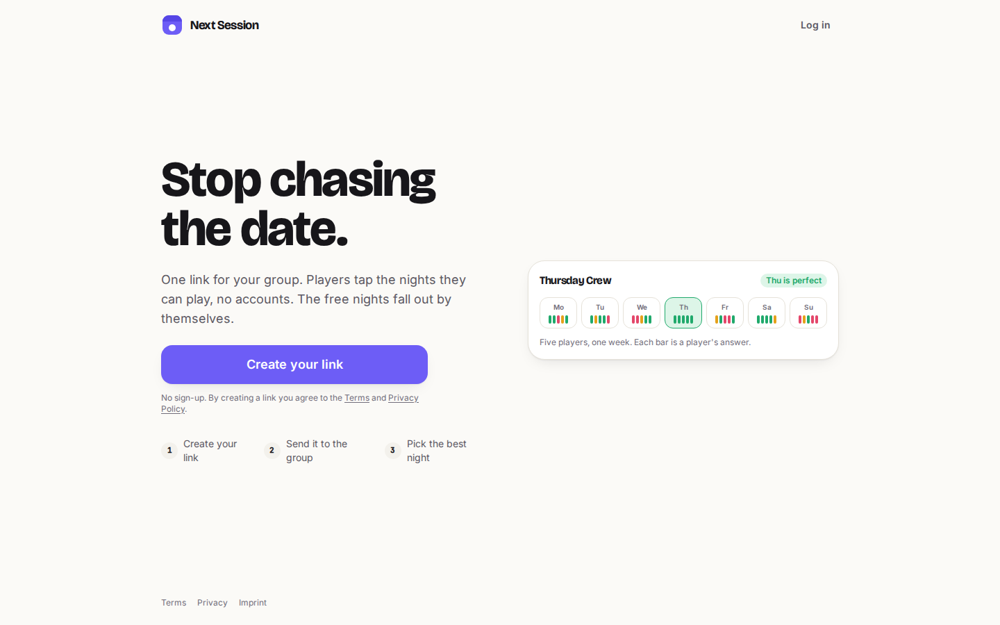
### landing, 1440 px, dark
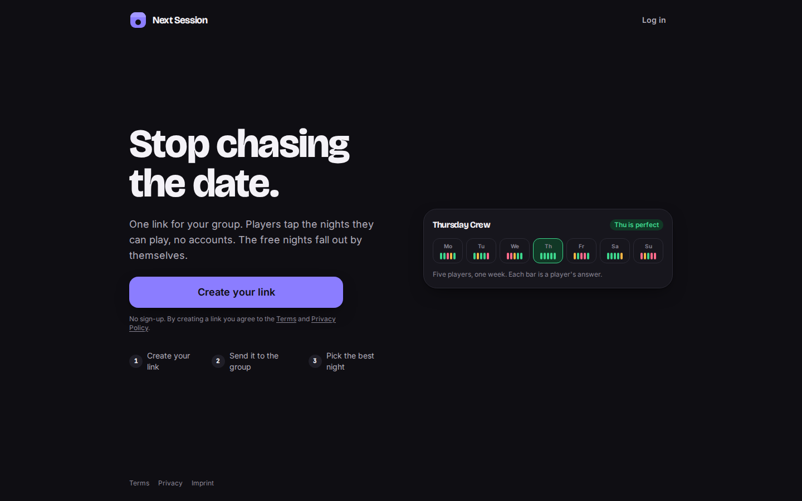
### link-created, 390 px, light
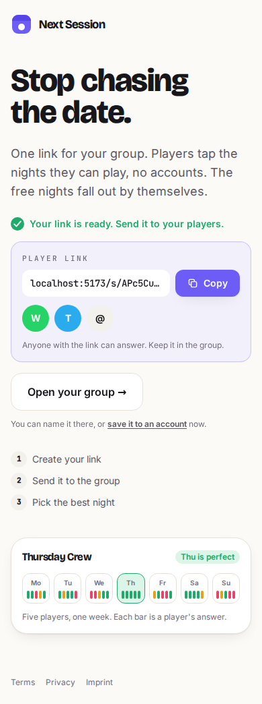
### link-created, 390 px, dark
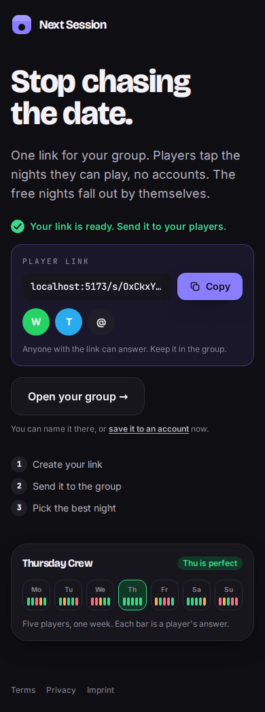
### link-created, 1440 px, light
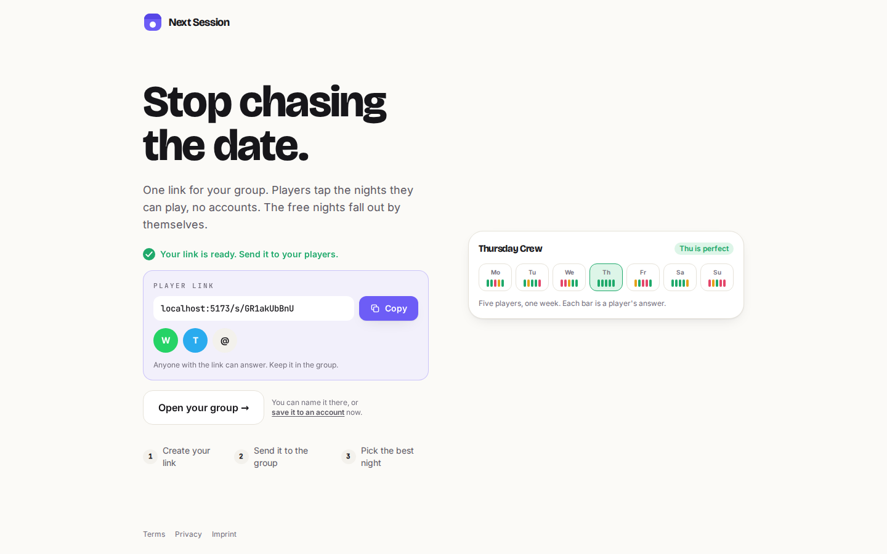
### link-created, 1440 px, dark
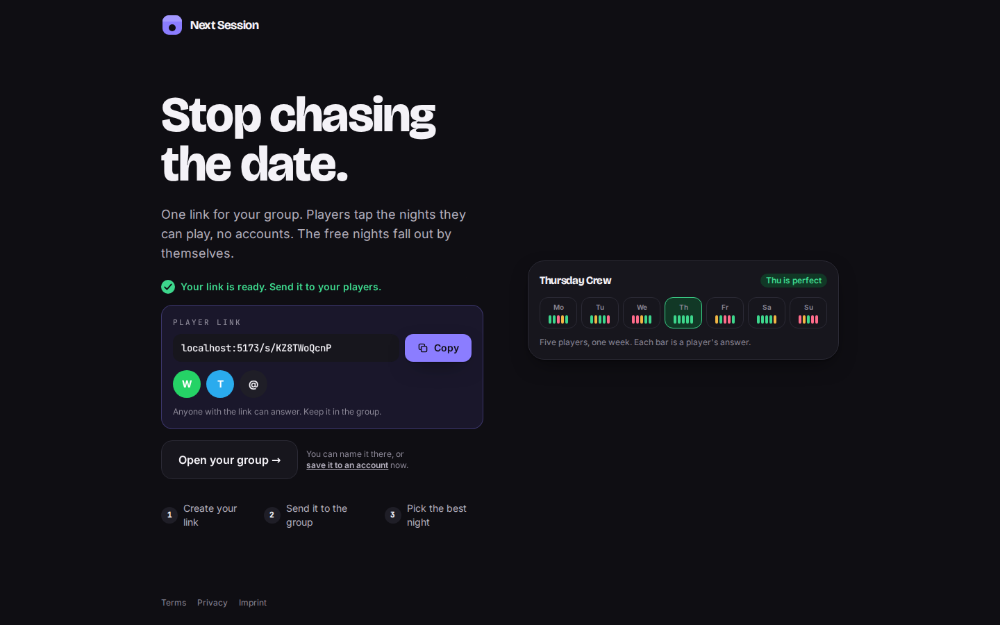
### save-sheet, 390 px, light

### save-sheet, 390 px, dark

### save-sheet, 1440 px, light
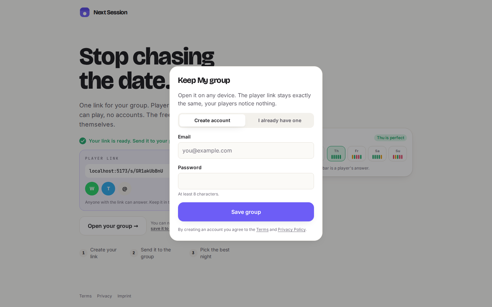
### save-sheet, 1440 px, dark
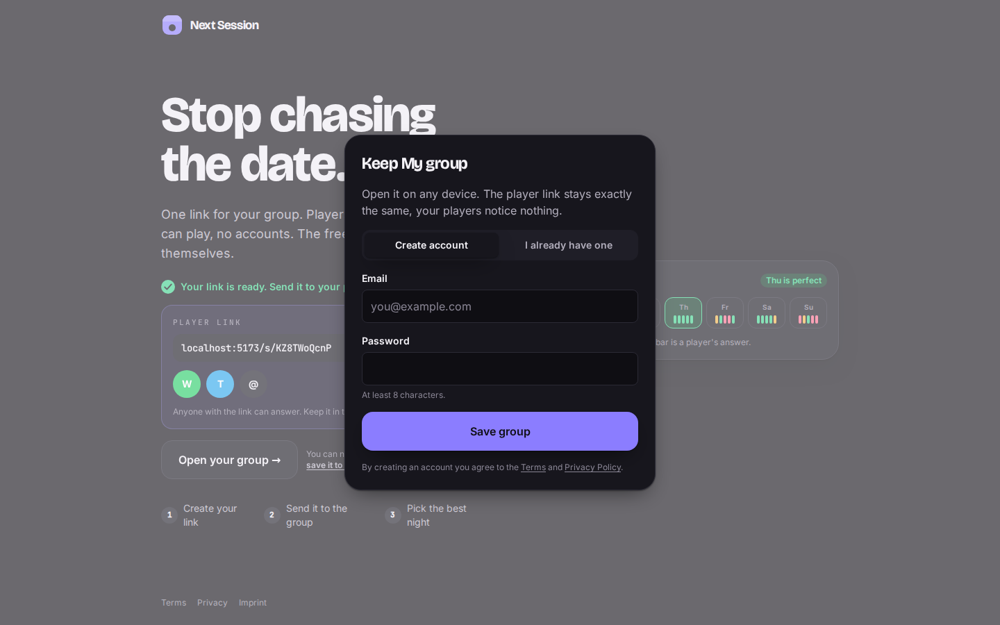
### log-in-error, 390 px, light

### log-in-error, 390 px, dark

### log-in-error, 1440 px, light
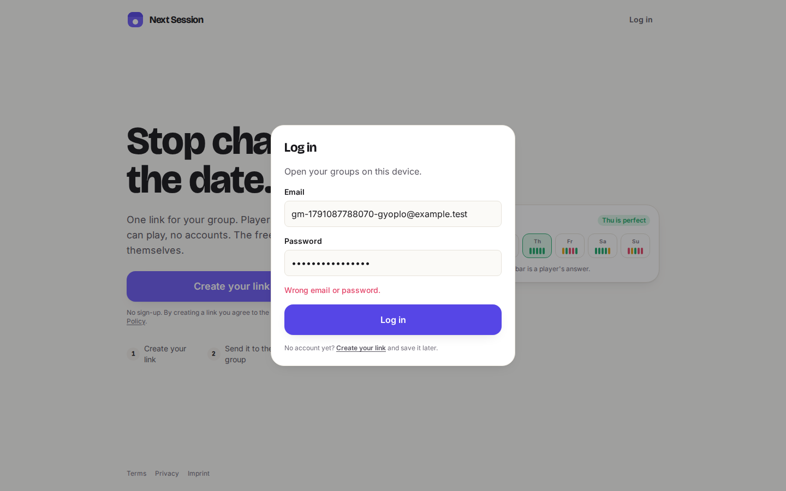
### log-in-error, 1440 px, dark
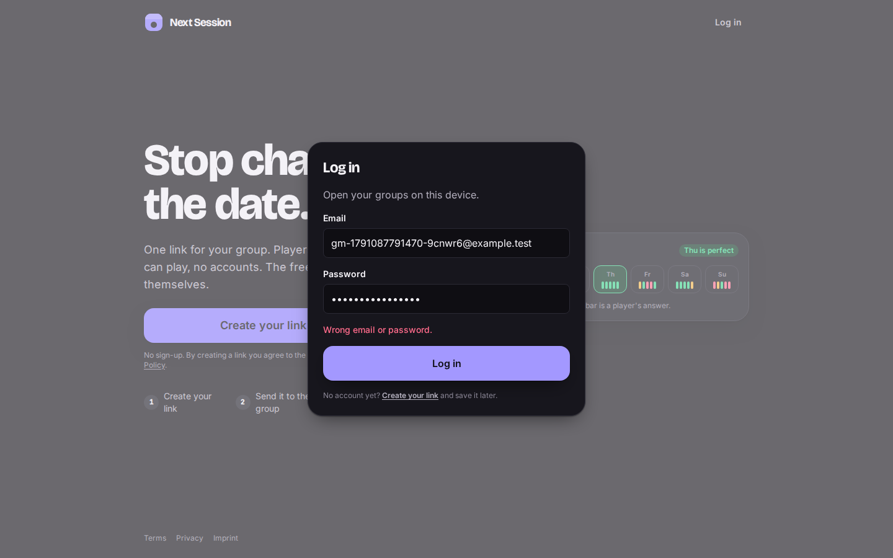
